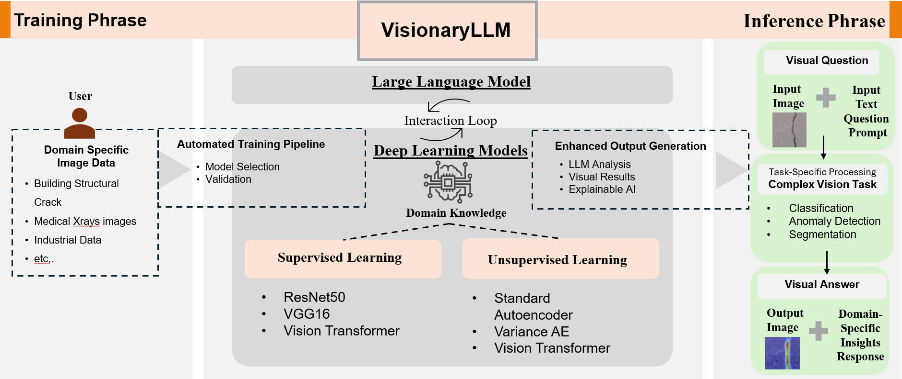

# VisionaryLLM: An Extensible Framework for Enhancing Large Language Models with Domain-Specific Vision Tasks

# [](https://github.com/pre-commit/pre-commit)
[](https://pytorch.org/get-started/locally/)
[](https://github.com/ashleve/lightning-hydra-template#license)


## Project Overview

VisionaryLLM addresses three fundamental limitations in current LLM applications:

1. **Domain-Specific Analysis**: Enhancing LLMs with precise, domain-specific visual analysis capabilities
2. **Visual Explanation**: Providing transparent insights into model decisions through Grad-CAM visualization
3. **Integration Complexity**: Offering a systematic, unified approach for consistent integration across domains

🌐 Project Demo: [https://cs5242-demo.silan.tech](https://cs5242-demo.silan.tech)

## System Architecture



### Project Structure

```
├── app/                    # Flask Backend Service
│   ├── routes/            # API endpoints
│   │   └── chat_api.py       # API utilities
│   └── __init__.py            # Flask application entry
├── src/                   # AI Model Implementation
│   ├── data/              # Data processing
│   │   ├── dataset.py     # Dataset implementations
│   │   └── preprocess.py  # Data preprocessing
│   ├── models/            # Model architectures
│   │   ├── resnet_model.py
│   │   ├── alexnet_model.py
│   │   ├── vit_model.py
│   │   ├── autoencoder.py
│   │   ├── variational_autoencoder.py
│   │   └── vit_anomaly.py
│   ├── training/          # Training implementations
│   │   ├── trainer.py
│   │   ├── autoencoder_trainer.py
│   │   ├── variational_autoencoder_trainer.py
│   │   └── vit_anomaly_trainer.py
│   ├── evaluation/        # Evaluation implementations
│   │   ├── evaluator.py
│   │   ├── autoencoder_evaluator.py
│   │   ├── variational_autoencoder_evaluator.py
│   │   └── vit_anomaly_evaluator.py
|   ├── utils/            # ALL interface provide by Deep learning model for backends   
│   │   ├── classfication.py     # inference function call for backend(setting on config.yaml)
│   │   └── training.py          # training and auto-evolute function call for backend
│   └── llm/              # LLM integration
│       └── agent.py	  # all the prompt template
├── data/                  # Data Storage
│   ├── _input/           # Frontend input storage
│   ├── _output/          # Model output storage
│   ├── raw/              # Raw dataset
│   │   ├── Negative/     # Non-crack images
│   │   └── Positive/     # Crack images
│   └── {other_datasets}/ # Additional datasets
├── checkpoints/          # all the model training and evolution files
│   ├── ...               # default for the raw dataset(crack detection)
│   └── {other_datasets}/ # Additional datasets
├── config/               # Configuration files
│   ├── config.yaml       # the core setting files for invidual training or framework running
│   └──  # Additional datasets
├── requirements.txt            # Project dependencies
├── .env				        # the enviroment variable[!!!please edit before you run!!!]
├── __pipeline_with_config.py   # training and evolution function test base on config.yaml 
├── __classfication_test.py     # calssfication function test base on config.yaml 
├── BreastMNIST_download.py     # the fastest way for you to download the BreastMNIST dataset
├── ChestMNIST_download.py      # the fastest way for you to download the ChestMNIST dataset
└── main.py                     # luanch the backend on localhost:5100
```

## Project Setup

### Environment Setup

```bash
# Clone repository
git clone https://github.com/Qingbolan/deep-learning-visual-analysis.git
cd deep-learning-visual-analysis

# Set up environment
conda create -n visual_analysis python=3.9
conda activate visual_analysis

# Install dependencies
pip install -r requirements.txt

# Download datasets
python setup_data.py
```

### Configuration

1. Create `.env` file in project root:
```plaintext
# Required for LLM Integration
OPENAI_API_KEY=<your_openai_api_key>
OPENAI_API_BASE=<your_openai_api_base_url>

SERVER_BASE_URL="http://127.0.0.1:5100"
API_file_PREFIX="/DL-api/"
```

2. Configure `config/config.yaml` for model settings:
```yaml
data:
  # raw_data_path: ./data/raw/
  raw_data_path: ./data/BreastMNIST/
  processed_data_path: ./data/processed/
  image_size: 224
  batch_size: 32
  num_workers: 4
  train_split: 0.8

method:
  type: supervised          # Available options: supervised, unsupervised

  supervised:
    model:
      name: alexnet           # Available options: resnet50, alexnet, vgg16, vit
      pretrained: False
      num_classes: 2
      learning_rate: 0.0001
      weight_decay: 0.00001
      num_epochs: 10
      device: cuda

  unsupervised:
    method: dcae       # Available options: dcae, dcvae, vit_anomaly

    dcae:
      model:
        name: dcae
        encoded_space_dim: 256    # add encoded space dimension
        learning_rate: 0.0001
        weight_decay: 0.00001
        num_epochs: 10
        device: cuda

    dcvae:
      model:
        name: dcvae
        encoded_space_dim: 256    # To VAE, this is the encoded space dimension
        learning_rate: 0.0001
        weight_decay: 0.00001
        num_epochs: 10
        device: cuda

    vit_anomaly:
      model:
        name: vit_anomaly
        pretrained: true                # Whether to use pretrained ViT weights
        num_classes: 2                  # Number of classification classes

        # Additional hyperparameters for ViTAnomalyDetector
        img_size: 224                   # Input image size
        patch_size: 16                  # Patch size for ViT
        embed_dim: 768                  # Embedding dimension
        num_heads: 12                   # Number of attention heads
        mlp_dim: 3072                   # MLP layer dimension
        num_layers: 12                  # Number of Transformer encoder layers

        learning_rate: 0.0001           # Optimizer learning rate
        weight_decay: 0.00001           # Optimizer weight decay
        num_epochs: 1                   # Total number of training epochs
        device: cuda                    # 'cuda' or 'cpu'

training:
  # checkpoint_path: ./checkpoints/
  checkpoint_path: ./checkpoints/BreastMNIST/
  save_every: 5

evaluation:
  metrics: ["accuracy", "precision", "recall", "f1", "confusion_matrix"]
  clustering_metrics: ["silhouette_score", "calinski_harabasz_score", "davies_bouldin_score"]
  anomaly_detection:
    dcae:
      threshold: 0.2                  # Example threshold, will be dynamically determined
    dcvae:
      threshold: 0.2                  # Example threshold, adjust based on data
    vit_anomaly:
      threshold: 0.2                  # Example threshold, adjust based on data

```

## Running the Project

1. Start the Flask Backend:
```bash
# From project root
python main.py
```
Backend will be available at `http://localhost:5100`

2. Train Models with command:
```bash
# From project root
python __pipeline_with_config.py
```

3. deep learning enhance classification:
```bash
python __classfication_test
```

## API Endpoints

```plaintext
POST /DL-api/api/completion
- Analyzes images using the specified model
- Supports multiple image formats
- Returns analysis results and visualizations

POST /DL-api/api/upload/ChatFiles
- upload image files
```

## Model Implementations

### Supervised Learning

We implemented and evaluated several traditional deep learning models to classify segmented image patches effectively.

#### ResNet50

ResNet50 introduces residual learning to facilitate the training of deep neural networks, effectively addressing the vanishing gradient problem.


**Key Features:**

- **Deep Residual Blocks**: Allowing the training of deeper networks without degradation in performance.
- **Batch Normalization**: Enhancing training stability and speed.
- **Global Average Pooling**: Reducing model parameters and preventing overfitting.

#### AlexNet

AlexNet is a pioneering convolutional neural network known for its success in the ImageNet competition, demonstrating the potential of deep learning in image classification.


**Key Features:**

- **Deep Convolutional Layers**: Extracting hierarchical features from images.
- **ReLU Activation**: Introducing non-linearity and accelerating training.
- **Dropout Layers**: Mitigating overfitting by randomly dropping neurons during training.

#### Vision Transformer (ViT)

ViT applies the Transformer architecture directly to image recognition tasks, leveraging self-attention mechanisms to capture global dependencies within images.


**Key Features:**

- **Patch Embedding**: Dividing images into patches and embedding them into a sequence.
- **Self-Attention Mechanism**: Enabling the model to focus on relevant parts of the image.
- **Transformer Blocks**: Facilitating the capture of complex feature relationships across the entire image.

### Unsupervised Learning

Our unsupervised models focus on learning intrinsic data representations and detecting anomalies without explicit labels.

#### Deep Convolutional Autoencoder (DCAE)

The DCAE employs a symmetric encoder-decoder architecture tailored for concrete crack image processing, focusing on dimensionality reduction and feature learning.


**Architecture Details:**

- **Encoder:**

  - Conv2D (3→2048, kernel=3x3)
  - Conv2D (2048→1024, kernel=3x3)
  - Conv2D (1024→512, kernel=3x3)
  - Fully Connected layer (512*2*2→128)
- **Latent Space:**

  - 128-dimensional representation
- **Decoder:**

  - Fully Connected layer (128→512*2*2)
  - ConvTranspose2D (512→512, kernel=3x3)
  - ConvTranspose2D (512→1024, kernel=3x3)
  - ConvTranspose2D (1024→2048, kernel=3x3)
  - ConvTranspose2D (2048→3, kernel=3x3)

**Key Features:**

- Maintains spatial information through convolutional operations.
- Enables efficient dimensionality reduction.
- Facilitates anomaly detection via reconstruction error.

#### Deep Convolutional Variational Autoencoder (DCVAE)

DCVAE extends the traditional autoencoder by introducing probabilistic encoding, enhancing the model's ability to generalize and detect anomalies.


**Architecture Details:**

- **Encoder:**

  - Conv2D (3→2048, kernel=3x3)
  - Conv2D (2048→1024, kernel=3x3)
  - Conv2D (1024→512, kernel=3x3)
  - Two parallel FC layers for μ and σ
- **Latent Space:**

  - Probabilistic sampling using the reparameterization trick: Z ~ N(μ, σ²I)
  - FC layer (512*2*2→128) for both mean and variance
- **Decoder:**

  - ConvTranspose2D (512→512, kernel=3x3)
  - ConvTranspose2D (512→1024, kernel=3x3)
  - ConvTranspose2D (1024→2048, kernel=3x3)
  - Final reconstruction layer

**Key Features:**

- Stochastic latent representation.
- KL divergence regularization.
- Enhanced generalization through variational inference.

#### Anomaly Detection using Vision Transformers

Our ViT-based anomaly detection system leverages the self-attention mechanism of transformers to identify irregular patterns in images without explicit labels.


**Architecture Components:**

1. **Image Tokenization and Embedding:**

   - Divides input images into fixed-size patches (e.g., 16x16 pixels).
   - Projects each patch into a higher-dimensional space using linear embedding.
   - Adds a special classification token and positional embeddings to retain spatial information.
2. **Transformer Encoder:**

   - Comprises multiple transformer blocks with layer normalization, multi-head self-attention, and MLP layers.
   - Utilizes residual connections for stable gradient flow.
3. **Classification Head:**

   - Processes the output corresponding to the classification token.
   - Produces a binary output indicating normal or anomaly.

**Key Features:**

- **Patch-Based Processing**: Maintains spatial relationships and enables parallel processing.
- **Self-Attention Mechanism**: Captures global dependencies and focuses on relevant image regions.
- **MLP Block Design**: Incorporates non-linearity and ensures robust feature learning.
- **Anomaly Detection Strategy**: Identifies deviations from learned normal patterns without explicit labels.

**Usage Example:**

```python
# Model initialization
model = ViTAnomalyDetector(
    img_size=224,          # Input image size
    patch_size=16,         # Size of each patch
    embed_dim=768,         # Embedding dimension
    num_heads=12,          # Number of attention heads
    num_layers=12,         # Number of transformer blocks
    mlp_ratio=4,           # MLP hidden dimension ratio
    num_classes=2          # Binary classification
)

# Anomaly detection
anomaly_scores = model.get_anomaly_score(images)
predictions = anomaly_scores > threshold
```

## Experimental Results(on Crack detections)

### Classification Performance

| Model    | Accuracy | Recall | Precision | F1 Score | Runtime (mins) |
| -------- | -------- | ------ | --------- | -------- | -------------- |
| AlexNet  | 0.9980   | 0.9987 | 0.9972    | 0.9980   | 13.14          |
| ResNet50 | 0.9995   | 0.9998 | 0.9993    | 0.9995   | 39.76          |
| VGG16    | 0.9982   | 0.9975 | 0.9982    | 0.9979   | 77.59          |
| ViT      | 0.9941   | 0.9990 | 0.9892    | 0.9941   | 120.48         |

### Anomaly Detection Performance

| Model       | Accuracy | Recall | Precision | F1 Score | Runtime (mins) |
| ----------- | -------- | ------ | --------- | -------- | -------------- |
| Standard AE | 0.9557   | 0.5359 | 0.9696    | 0.6868   | 13.91          |
| VAE         | 0.9418   | 0.3775 | 0.9557    | 0.5413   | 15.94          |
| ViT Anomaly | 0.9968   | 0.9987 | 0.9947    | 0.9967   | 22.48          |

## Cross-Domain Applications

The framework has been validated in multiple domains:

### Structural Engineering
- Crack detection in concrete structures
- ResNet50 performance: 99.95% accuracy
- Transparent defect localization through Grad-CAM

### Medical Imaging
- Breast ultrasound tumor detection
- 90.67% detection accuracy
- Visualization of suspicious regions

## Team

<table>
  <tr>
    <td align="center">
      <a href="https://github.com/Qingbolan">
        
        <br /><sub><b>HU SILAN</b></sub>
      </a>
      <br />
      <a href="mailto:e1373455@u.nus.edu">📧</a>
    </td>
    <td align="center">
      <a href="#">
        
        <br /><sub><b>Tan Kah Xuan</b></sub>
      </a>
      <br />
      <a href="mailto:e0692305@u.nus.edu">📧</a>
    </td>
  </tr>
</table>

## License

This project is licensed under the MIT License - see the [LICENSE](LICENSE) file for details.

## Citation

```bibtex
@misc{hu2024visionaryllm,
  title={VisionaryLLM: An Extensible Framework for Enhancing Large Language Models with Domain-Specific Vision Tasks},
  author={Hu, Silan and Tan, Kah Xuan},
  year={2024},
  publisher={GitHub},
  howpublished={\url{https://github.com/Qingbolan/Vision-LLM-Integration}}
}
```
