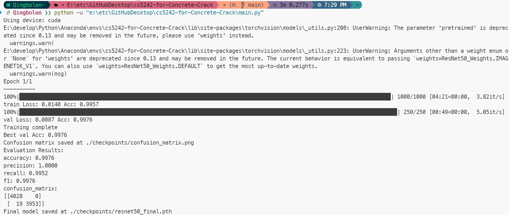
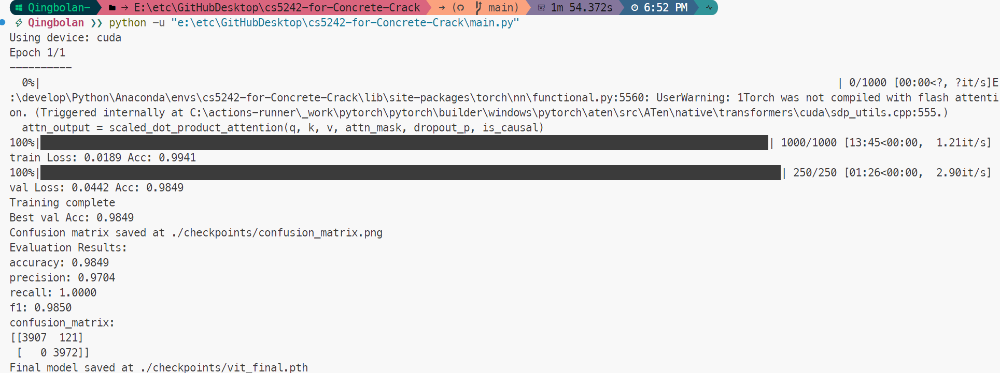
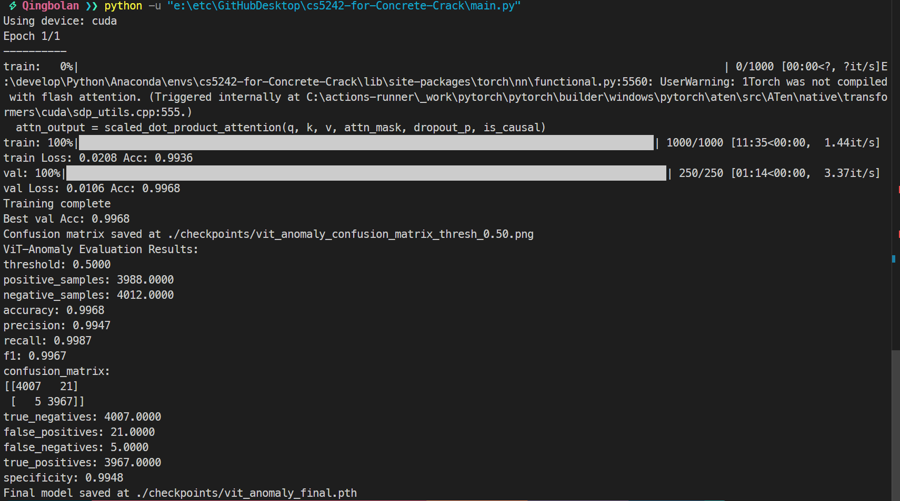

# Concrete Crack Image Classification

[](https://github.com/pre-commit/pre-commit)
[](https://pytorch.org/get-started/locally/)
[](https://github.com/ashleve/lightning-hydra-template#license)

This project focuses on the **automatic classification of concrete crack images**, an essential task in structural health monitoring of infrastructure. By accurately identifying cracks in concrete structures, we can facilitate timely maintenance and prevent potential failures.

We implement and compare several advanced deep learning models, including:

- **ResNet50**
- **AlexNet**
- **VGG16**
- **Vision Transformer (ViT)**
- **EfficientNet**
- **Deep Convolutional Autoencoder (DCAE)**
- **Deep Convolutional Variational Autoencoder (DCVAE)**
- **Anomaly Detection using Vision Transformers**

All models are trained and evaluated on the "Concrete Crack Images for Classification" dataset to solve this binary classification problem.

## Table of Contents

- [Project Motivation](#project-motivation)
- [Code Structure](#code-structure)
- [Project Setup](#project-setup)
- [Dataset](#dataset)
- [Models Implemented](#models-implemented)
  - [ResNet50](#resnet50)
  - [AlexNet](#alexnet)
  - [VGG16](#vgg16)
  - [Vision Transformer (ViT)](#vision-transformer-vit)
  - [EfficientNet](#efficientnet)
  - [Deep Convolutional Autoencoder (DCAE)](#deep-convolutional-autoencoder-dcae)
  - [Deep Convolutional Variational Autoencoder (DCVAE)](#deep-convolutional-variational-autoencoder-dcvae)
  - [Anomaly Detection using Vision Transformers](#anomaly-detection-using-vision-transformers)
- [Experimentation and Results](#experimentation-and-results)
- [Usage](#usage)
  - [Training](#training)
  - [Evaluation](#evaluation)
  - [Configuration](#configuration)
- [Acknowledgements](#acknowledgements)
- [Contributors](#contributors)
- [License](#license)

## Project Motivation

Crack detection in concrete structures is vital for ensuring the safety and longevity of infrastructure. Traditional manual inspection methods are time-consuming and prone to human error. Automating this process using deep learning can significantly enhance inspection efficiency and accuracy.

In this project, we aim to:

- **Explore a variety of deep learning models** for image classification, ranging from classical CNN architectures to modern transformer-based models.
- **Evaluate and compare the performance** of these models on the concrete crack detection task.
- **Implement both supervised and unsupervised learning approaches**, including anomaly detection methods.
- **Reflect on the strengths and weaknesses** of each model to provide insights into their practical applicability.

This comprehensive exploration not only deepens our understanding of deep learning techniques but also contributes to practical solutions in the field of structural engineering.

## Code Structure

- **Data Loading and Preprocessing**: `src/data/dataset.py`, `src/data/preprocess.py`
- **Model Definitions**:
  - `src/models/resnet_model.py`
  - `src/models/alexnet_model.py`
  - `src/models/vgg_model.py`
  - `src/models/vit_model.py`
  - `src/models/efficientnet_model.py`
  - `src/models/autoencoder.py` (DCAE)
  - `src/models/variational_autoencoder.py` (DCVAE)
- **Training Logic**:
  - `src/training/trainer.py`
  - `src/training/autoencoder_trainer.py`
  - `src/training/variational_autoencoder_trainer.py`
- **Evaluation Code**:
  - `src/evaluation/evaluator.py`
  - `src/evaluation/autoencoder_evaluator.py`
  - `src/evaluation/variational_autoencoder_evaluator.py`
- **Main Script**: `main.py`
- **Configuration Files**: `config/config.yaml`, various files under `configs/`

## Project Setup

Follow these steps to set up the project environment:

```bash
# Clone the repository
git clone https://github.com/Qingbolan/cs5242-for-Concrete-Crack.git
cd cs5242-for-Concrete-Crack

# Create a virtual environment
conda create -n concrete_crack python=3.9
conda activate concrete_crack

# Install PyTorch according to your system specifications
# Visit https://pytorch.org/get-started/locally/ for installation commands

# Install project dependencies
pip install -r requirements.txt

# Create outputs directory
mkdir outputs
```

Make sure you have met the prerequisites for [PyTorch](https://pytorch.org/) and installed the corresponding version compatible with your CUDA or CPU setup.

## Dataset

Please download the dataset from [Concrete Crack Images for Classification](https://data.mendeley.com/datasets/5y9wdsg2zt/2) and place the images in the `data/raw/` directory following this structure:

```
data/
├── raw/
│   ├── Negative/
│   └── Positive/
```

- **Negative**: Images without cracks.
- **Positive**: Images with cracks.

## Models Implemented

### Supervised(3)

#### ResNet50

ResNet50 introduces residual learning to ease the training of deep neural networks. It helps in avoiding vanishing gradient problems.

![ResNet Architecture][]


#### AlexNet

AlexNet is one of the pioneering models in deep learning, known for its success in the ImageNet competition.

![AlexNet Architecture][]


### VGG16

VGG16 uses very small (3x3) convolution filters, which showed that the depth of the network is a critical component for good performance.

![VGG16 Architecture][]


#### Vision Transformer (ViT)

ViT applies the Transformer architecture directly to image recognition, with great success when pre-trained on large datasets.

![Vision Transformer Architecture][]



### Unsupervised(3)

#### Deep Convolutional Autoencoder (DCAE)

The Deep Convolutional Autoencoder (DCAE) is implemented with a symmetric encoder-decoder architecture designed specifically for concrete crack image processing. Our implementation follows a carefully designed structure:

**Architecture Details:**

- **Encoder:**

  - Conv2D (3→2048, kernel=3x3)
  - Conv2D (2048→1024, kernel=3x3)
  - Conv2D (1024→512, kernel=3x3)
  - Fully Connected layer (512*2*2→128)
- **Latent Space:**

  - 128-dimensional representation
- **Decoder:**

  - Fully Connected layer (128→512*2*2)
  - ConvTranspose2D (512→512, kernel=3x3)
  - ConvTranspose2D (512→1024, kernel=3x3)
  - ConvTranspose2D (1024→2048, kernel=3x3)
  - ConvTranspose2D (2048→3, kernel=3x3)


*(Reference to (a) Convolutional Autoencoder in the diagram)*

#### Deep Convolutional Variational Autoencoder (DCVAE)

The Deep Convolutional Variational Autoencoder (DCVAE) extends the traditional autoencoder by introducing a probabilistic approach to the latent space encoding. Our implementation features:

**Architecture Details:**

- **Encoder:**

  - Conv2D (3→2048, kernel=3x3)
  - Conv2D (2048→1024, kernel=3x3)
  - Conv2D (1024→512, kernel=3x3)
  - Two parallel FC layers for μ and σ
- **Latent Space:**

  - Probabilistic sampling using the reparameterization trick
  - Z ~ N(μ, σ²In)
  - FC layer (512*2*2→128) for both mean and variance
- **Decoder:**

  - ConvTranspose2D (512→512, kernel=3x3)
  - ConvTranspose2D (512→1024, kernel=3x3)
  - ConvTranspose2D (1024→2048, kernel=3x3)
  - Final reconstruction layer

Key Features:

- Stochastic latent representation
- KL divergence regularization
- Better generalization through variational inference


*(Reference to (b) Convolutional Variational Autoencoder in the diagram)*

Both architectures are designed to:

- Maintain spatial information through convolutional operations
- Provide efficient dimensionality reduction
- Learn meaningful representations of concrete crack features
- Enable anomaly detection through reconstruction error

#### Anomaly Detection using Vision Transformers

Our Vision Transformer (ViT) based anomaly detection system implements a specialized architecture designed specifically for concrete crack detection. The model consists of three main components as illustrated in the diagram:

**1. Image Tokenization and Embedding:**

- Input images are divided into fixed-size patches (shown as x1-x9 in the diagram)
- Patches are arranged in a grid format (3x3 as shown)
- Linear Embedding (E) projects each patch into a higher dimensional space
- Special classification token (Vclass) is prepended to the sequence
- Positional embeddings are added to retain spatial information

**2. Transformer Encoder:**
Each Transformer Encoder block contains:

- Layer Normalization (LN)
- Multi-Head Self Attention (MSA)
  - Linear projections for Query (Q), Key (K), and Value (V)
  - Scaled Dot-Product Attention mechanism
  - h parallel attention heads
  - Concatenation and linear projection of attention outputs
- MLP block consisting of:
  - Fully Connected Layer
  - GeLU Activation
  - Fully Connected Layer
- Residual connections (+) around both MSA and MLP blocks

**3. Classification Head:**

- Final classification layer for anomaly detection
- Uses the output corresponding to the classification token
- Produces binary output (normal/anomaly)

**Detailed Architecture:**


```
Input Image
└── Patch + Position Embeddings
    ├── Image patches (x1...x9)
    ├── Linear embedding
    ├── Classification token (Vclass)
    └── Positional encoding
  
Transformer Encoder
└── Multiple blocks of:
    ├── Layer Norm (LN)
    ├── Multi-Head Self Attention (MSA)
    │   ├── Q, K, V linear projections
    │   ├── Scaled dot-product attention
    │   └── Multi-head concatenation
    ├── Residual connection
    ├── Layer Norm (LN)
    ├── MLP
    │   ├── Fully Connected
    │   ├── GeLU
    │   └── Fully Connected
    └── Residual connection

Classification Head
└── Final classifier for anomaly detection
```

**Key Features:**

1. **Patch-based Processing:**

   - Divides input image into fixed-size patches
   - Maintains spatial relationships through positional embeddings
   - Enables parallel processing of image regions
2. **Self-Attention Mechanism:**

   - Captures global dependencies between patches
   - Multiple attention heads for different feature aspects
   - Scaled dot-product attention for stable training
3. **MLP Block Design:**

   - Two-layer feedforward network
   - GeLU activation for non-linearity
   - Residual connections for better gradient flow
4. **Anomaly Detection Strategy:**

   - Uses classification token's final representation
   - Learns normal pattern characteristics
   - Identifies deviations as potential anomalies

This architecture is particularly effective for concrete crack detection because:

- It can capture both local and global features
- The attention mechanism helps focus on relevant image regions
- The deep representation learning enables subtle anomaly detection
- The patch-based approach is suitable for detecting crack patterns

Implementation details and example usage can be found in `src/models/vit_anomaly.py` and `src/training/vit_anomaly_trainer.py`.

**Usage Example:**

```python
# Model initialization
model = ViTAnomalyDetector(
    img_size=224,          # Input image size
    patch_size=16,         # Size of each patch
    embed_dim=768,         # Embedding dimension
    num_heads=12,          # Number of attention heads
    num_layers=12,         # Number of transformer blocks
    mlp_ratio=4,          # MLP hidden dimension ratio
    num_classes=2          # Binary classification
)

# Anomaly detection
anomaly_scores = model.get_anomaly_score(images)
predictions = anomaly_scores > threshold

```



## Experimentation and Results

We conducted extensive experiments with the aforementioned models to evaluate their performance in the task of concrete crack detection.

**Performance Metrics**:

- **Accuracy**
- **Precision**
- **Recall**
- **F1 Score**
- **Confusion Matrix**

**Experimental Findings**:

1. **ResNet50** achieved high accuracy due to its deep architecture and residual connections, which help in learning complex features.
2. **AlexNet**, despite being one of the earlier models, performed reasonably well but was outperformed by deeper networks.
3. **VGG16** showed strong performance thanks to its depth, but at the cost of increased computational resources.
4. **Vision Transformer (ViT)** demonstrated that transformer architectures can be effectively applied to image classification tasks, achieving competitive performance.
5. **EfficientNet** provided an excellent balance between accuracy and computational efficiency due to its scalable architecture.
6. **DCAE and DCVAE** were used for feature extraction and anomaly detection. While not directly classifying images, they helped in understanding the underlying data representation.
7. **Anomaly Detection using ViT** highlighted the model's capacity to detect anomalies without explicit labels, which is valuable in scenarios with limited annotated data.

**Observations**:

- **Data Augmentation**: Implementing data augmentation techniques improved model generalization.
- **Hyperparameter Tuning**: Careful tuning of learning rates, batch sizes, and optimizers was crucial for model convergence.
- **Computational Resources**: Transformer-based models required more computational power, highlighting the need for efficient training strategies.
- **Unsupervised Learning**: Including unsupervised methods like autoencoders provided additional insights into the data and potential for anomaly detection.

## Usage

### Training

To train a model, modify the `config/config.yaml` file to set the desired model and parameters.

Example: To train with ResNet50:

```yaml
model:
  name: resnet50
  pretrained: true
  num_classes: 2
  # Other model-specific parameters
```

Then run:

```bash
python main.py
```

### Evaluation

After training, the model will automatically be evaluated on the validation set, and metrics will be displayed. To perform additional evaluation:

```bash
python main.py --evaluate --ckpt_path path/to/checkpoint.pth
```

### Configuration

All configurations are managed through YAML files for clarity and flexibility. Parameters can also be overridden via command-line arguments.

Example:

```bash
python main.py model.name=efficientnet model.pretrained=False
```

## Acknowledgements

We are grateful to the providers of the [Concrete Crack Images for Classification](https://data.mendeley.com/datasets/5y9wdsg2zt/2) dataset.

**Citations**:

- Özgenel, Ç.F., & Gönenç Sorguç, A. (2018). *Performance Comparison of Pretrained Convolutional Neural Networks on Crack Detection in Buildings*. ISARC 2018, Berlin.
- Zhang, L., Yang, F., Zhang, Y. D., & Zhu, Y. J. (2016). *Road Crack Detection Using Deep Convolutional Neural Network*. IEEE International Conference on Image Processing (ICIP). http://doi.org/10.1109/ICIP.2016.7533052

## Contributors

- **HU SILAN** ([Qingbolan](https://github.com/Qingbolan)) - Project Lead, Model Implementation, Experimentation
- **Tan Kah Xuan** - Data Preparation, Model Training, Evaluation

We would also like to acknowledge the open-source community for providing invaluable resources and inspiration for this project.

## License

This project is licensed under the MIT License - see the [LICENSE](LICENSE) file for details.
*Note*: This project is part of an academic exploration into deep learning techniques for image classification. The implementations and findings reflect extensive work and critical thinking in applying state-of-the-art models to a practical problem. We have extensively compared different architectures, implemented both supervised and unsupervised learning methods, and provided thorough documentation to aid in understanding and reproducibility.

Feel free to explore the codebase, run experiments, and contribute to the project!

**Project GitHub Link**: [https://github.com/Qingbolan/cs5242-for-Concrete-Crack](https://github.com/Qingbolan/cs5242-for-Concrete-Crack)

<table>
  <tr>
    <td align="center"><a href="https://github.com/Qingbolan"><br /><sub><b>HU SILAN</b></sub></a><br /><a href="https://github.com/Qingbolan/cs5242-for-Concrete-Crack" title="Code">💻</a></td>
    <td align="center"><a href="#"><br /><sub><b>Tan Kah Xuan</b></sub></a><br /><a href="https://github.com/Qingbolan/cs5242-for-Concrete-Crack" title="Code">💻</a></td>
  </tr>
</table>
